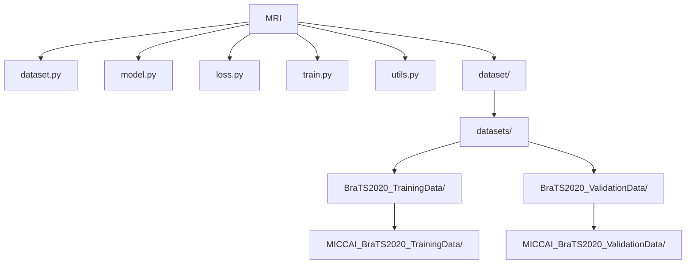

# **MRI多模态3D脑部肿瘤识别模型**

## 前言

本次项目旨在使用BraTS2020公开脑部MRI数据，通过深度学习模型对MRI多模态的3D脑部图像进行肿瘤区域的识别。

## 项目代码

### 1. 结构



### 2. Data.py

首先是对BraTS2020公开脑部MRI数据进行处理，以便在后续训练和验证中使用

引用部分，主要使用到的工具是：

- numpy(负责图像数组处理)
- nibabel(这个库是第一次接触，主要用于一些医疗图像数据的读取和保存)
- pytorch(这里的torch主要用于训练数据等的打包，使用Dataset封装方便模型调用)

```
import os
import numpy as np
import nibabel as nib
import torch
from torch.utils.data import Dataset
import random

MODALITIES = ['flair', 't1', 't1ce', 't2']
```

其中定义的MODALITTIES代表着多模态，每个案例文件夹中都有五个文件，除去标签文件，其他的四个均为不同处理结果的MRI模态图像：

- ​    _flair.nii	FLAIR模态
- ​    _t1.nii	    T1模态
- ​    _t1ce.nii	T1对比增强模态
- ​    _t2.nii	    T2模态
- ​    _seg.nii	标签（分割）

**接下来我们开始创建数据类：**

```python
class BraTSDataset(Dataset):
    def __init__(self, root_dir, patch_size=(128, 128, 128), mode='train', sample_num=4, min_tumor_voxels=100, augment=False):

        self.root_dir = root_dir
        self.patch_size = patch_size
        self.sample_num = sample_num
        self.mode = mode
        self.min_tumor_voxels = min_tumor_voxels
        self.augment = augment

        self.patient_dirs = sorted([
            os.path.join(root_dir, d) for d in os.listdir(root_dir)
            if os.path.isdir(os.path.join(root_dir, d)) 
            #判断每个案例文件夹名称是否正确，正确就添加到全部列表中用于选择
        ])
```

首先是类的一些关键函数：

- root_dir: 数据根目录
- patch_size: 裁剪patch大小
- mode: 'train'或'test'，后续可以针对测试实现不同策略
- sample_num: 每个病人采样patch数量（四个模态所以是4）
- min_tumor_voxels: 采样patch时肿瘤体素最小数量阈值（切片的时候需要尽可能满足这个条件）
- augment: 是否启用简单数据增强

其次是对患者（案例）的文件进行确认，确保路径合法且可用。

**定义一些魔法方法，方便后续调用类时能够快速使用：**

```python
def __len__(self):
    return len(self.patient_dirs) * self.sample_num 
#完整数据集长度，就是数据集文件夹中的有效案例数，并且每个案例中有四个

def __getitem__(self, idx):
    patient_idx = idx // self.sample_num
    patient_dir = self.patient_dirs[patient_idx]   
    #由于上述在数据集描述中提到的问题，所以实际上病人（案例）的数量是总共数据量/4
```

由于每一个案例中都包含了四个不同的模态图像，所以实际上的数据量是案例数量*每个案例的模态数量(本次项目是4)，然后我们通过idx(也就是案例数量)选择数据的时候需要让他们4个一组，所以//4，；例如输入0或2的时候都是从第1个案例中选择，输入5的时候就是第二个案例

**继续__getitem()__**

我们要将每个案例中的不同**模态图像**都**读取**并转化为张量

```python
        #处理四个模态的图像
        images = []     
        #创建图像数组
        for modality in MODALITIES: 
            #四个模态图像
            img_path = os.path.join(patient_dir, f"{os.path.basename(patient_dir)}_{modality}.nii") 
            #读取每个模态图像
            try:
                img = nib.load(img_path).get_fdata() 
                #使用nibabel读取图像并转换成numpy的浮点数组
            except Exception as e:
                print(f"Warning: failed to load {img_path}: {e}")
                img = np.zeros(self.patch_size)  
                # 失败时用0填充避免崩溃
            img = self.zscore_normalize(img) 
            #进行标准化
            images.append(img) 
            #把四个模态图像的数组，加入数组中

        image_np = np.stack(images, axis=0)  
        # [4, H, W, D] #np.stack()有点像list.append(list()),相当于往np数组里加入一个相同长度的数组，并增加一个维度，这里面的4就是代表四个模态的维度
```

遍历每一个案例，读取其中的四个模态图像，每个模态图像尺寸为(240,240,155),其中长宽为240*240(二维平面)，155为深度切片，结合起来就可以成为一个3D图像。使用numpy转化成三维浮点数组[][][][][240,240,155]。

然后对每一个图像数组做**标准化**处理(标准差)，代码如下：

```python
    def zscore_normalize(self, img): 
        #zero score标准差，就是把非零区域的像素值标准化为“均值为 0、标准差为 1”的分布，方便模型更快收敛。
        mask = img > 0      
        #使用np数组(img)进行筛选，这里img>0相当于是遍历img中的数字，然后和0做对比，比0大的在mask中就是true，小的就是false
        if np.any(mask):    
            #只要mask中含有ture的就进行标准差操作
            mean = img[mask].mean()     
            #通过mask筛选非0区域，并计算均值和标准差
            std = img[mask].std()
            img_copy = img.copy()        
            # 避免修改原数组，用copy复制出来一份，然后修改复制的图像数组，这样原图像不会有问题
            img_copy[mask] = (img_copy[mask] - mean) / (std + 1e-8)  
            #然后做标准差，把非0的部分减去平均值（这样数据就变成以0为中心然后左右分布），再除以标准差就能让数据分布更紧凑一点
        return img_copy
```

图像数组中数据分布通常是非常分散的（例如，空白处为0，有图像的地方可能是20，或者60等，差值非常大），所以要做标准化处理，这里使用到了一个np数组的重要用法：

**np_array[mask]**

其中mask是遮盖选择，通过mask = img > 0 对非0区域进行筛选(np还是比较牛逼的，直接自动遍历了img中所有的数据，然后大于0的就在mask上填充true，其他的就是false)，经过筛选后mask的结构是一个和img一样[240,240,155]的数组，填充内容为布尔值。

np_array[mask]就可以根据mask的布尔值选择相应的数据做处理，这里选择了非0的数据，然后计算它们的平均值和标准差**np.mean()和np.std()**，然后再复制一下图像数组，防止修改原图会出现错误，然后使用标准差公式进行标准化：
$$
img[mask] = (img[mask] - mean) / (std + 1e-8)
$$
公式内容为非0数据减去中间值，形成以0为中心左右分布的整数值，再除以标准差（方差），其中为防止除0问题，需要给标准差加入一个极小数（1e-8为0.00000001）。对比一下标准化前后的图像：


在经过标准化后，将四个模态的图像添加到“images”数组中（这里还相当于是四个list），使用np.stack()功能将四个模态的图像合并成4维的数组（相当于将4list合并成数组的列——新的维度，前提是要确保这四个list中的结构是相同的，例如都是240，240，155），最终image_np数组结构为[4,240,240,155]，其中4代表了4个模态的图像。

**读取标签图像**也是同理，只不过标签图像数组结构为[240,240,155]，只有三维。

```python
#处理标签图像
seg_path = os.path.join(patient_dir, f"{os.path.basename(patient_dir)}_seg.nii") #获取标签
try:
    seg = nib.load(seg_path).get_fdata()#将标签数据转化为numpy浮点数组
except Exception as e:
    print(f"Warning: failed to load {seg_path}: {e}")
    seg = np.zeros(self.patch_size)

label_np = seg.astype(np.uint8)      # [H, W, D] 长度，宽度，深度(切片高度),把标签里的数据转换成unit8整数类型(原本可能是float之类的)，方便后续训练和loss计算。
```

为了确保在训练时方便和高效，所以这里将标签数组中的数据做了下转换，使用np.astype(np.uint8)让其从float等类型转换成int类型。这个标签实际上就是肿瘤位置的信息，用plot输出之后可以看到每张切片里只有肿瘤区域是亮的：


```
    image_np = np.stack(images, axis=0)  # [4, H, W, D] #np.stack()有点像list.append(list()),相当于往np数组里加入一个相同长度的数组，并增加一个维度，这里面的4就是代表四个模态的维度
    label_np = seg.astype(np.uint8)      # [H, W, D] 长度，宽度，深度(切片高度),把标签里的数据转换成unit8整数类型(原本可能是float之类的)，方便后续训练和loss计算。

    # 随机裁剪patch，重点保证肿瘤区域覆盖
    image_np, label_np = self.random_crop(image_np, label_np)#因为默认的图像太大了，训练起来很麻烦，所以切成128的三维图像，然后尽可能保留肿瘤区域

    # 简单数据增强示例，随机翻转
    if self.augment and self.mode == 'train':
        if random.random() > 0.5:
            image_np = np.flip(image_np, axis=2)  # 随机左右翻转
            label_np = np.flip(label_np, axis=1)

    return torch.tensor(image_np.copy(), dtype=torch.float32), torch.tensor(label_np.copy(), dtype=torch.long)
```


