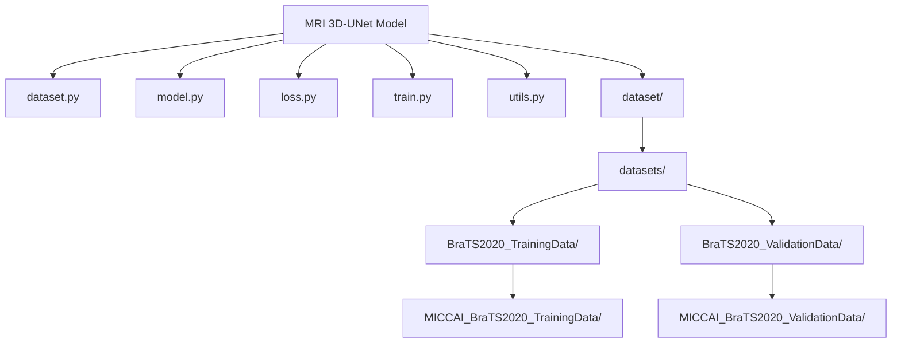
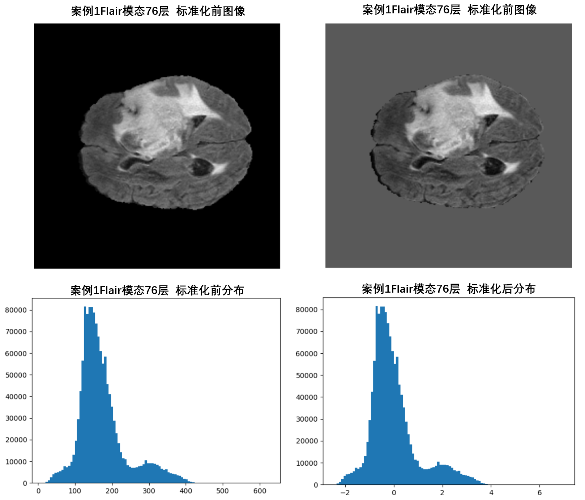
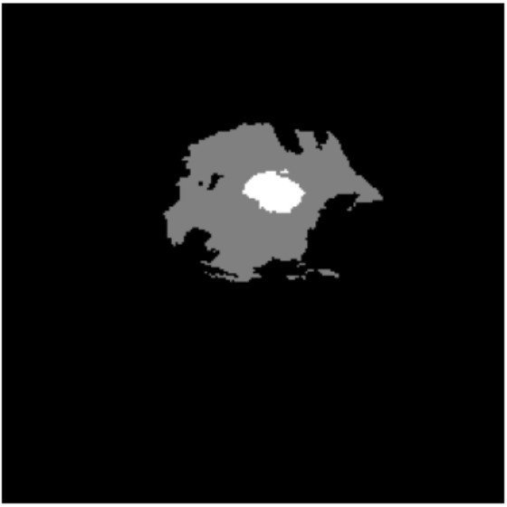
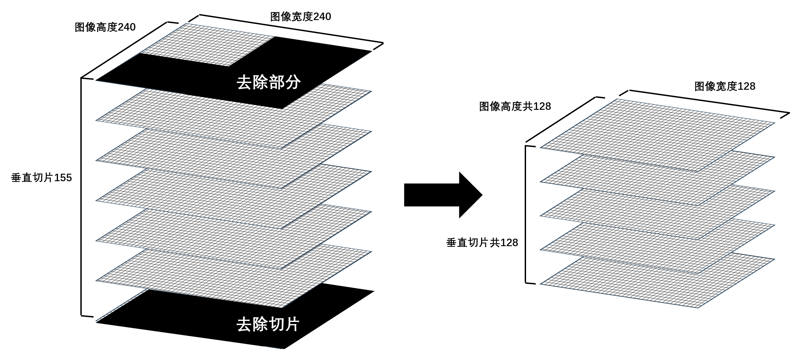
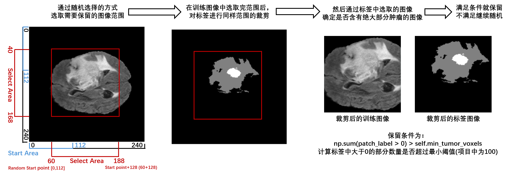
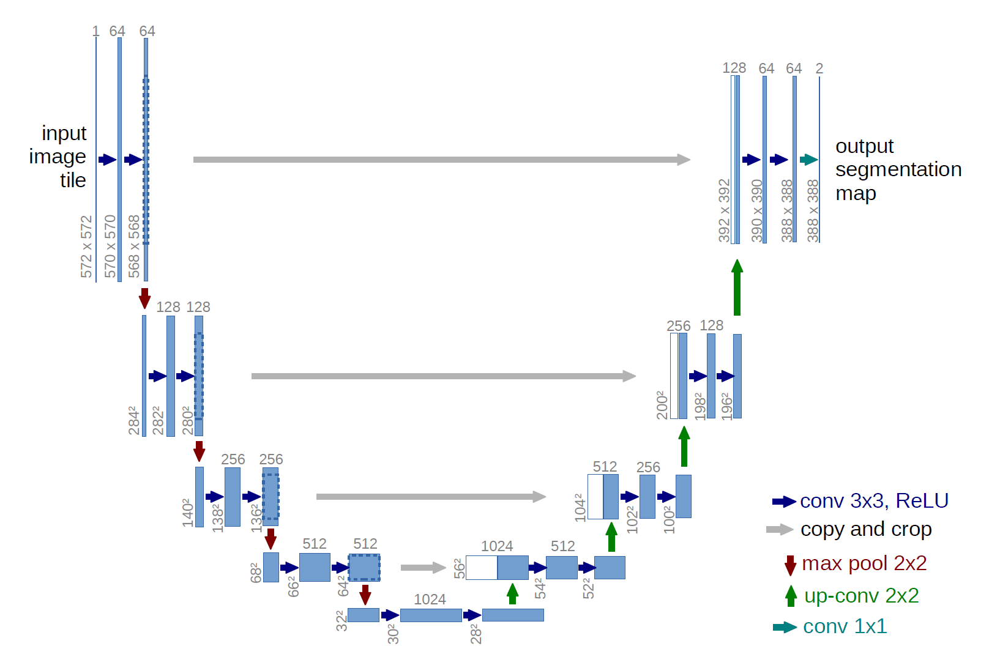

# **MRI多模态3D脑部肿瘤识别模型**

## 前言

本次项目旨在使用BraTS2020公开脑部MRI数据，通过深度学习模型对MRI多模态的3D脑部图像进行肿瘤区域的识别。

## 项目代码

### 1. 结构



### 2. Data.py

首先是对BraTS2020公开脑部MRI数据进行处理，以便在后续训练和验证中使用

引用部分，主要使用到的工具是：

- numpy(负责图像数组处理)
- nibabel(这个库是第一次接触，主要用于一些医疗图像数据的读取和保存)
- pytorch(这里的torch主要用于训练数据等的打包，使用Dataset封装方便模型调用)

```python
import os
import numpy as np
import nibabel as nib
import torch
from torch.utils.data import Dataset
import random

MODALITIES = ['flair', 't1', 't1ce', 't2']
```

其中定义的MODALITTIES代表着多模态，每个案例文件夹中都有五个文件，除去标签文件，其他的四个均为不同处理结果的MRI模态图像：

- ​    _flair.nii	FLAIR模态
- ​    _t1.nii	    T1模态
- ​    _t1ce.nii	T1对比增强模态
- ​    _t2.nii	    T2模态
- ​    _seg.nii	标签（分割）

**接下来我们开始创建数据类：**

```python
class BraTSDataset(Dataset):
    def __init__(self, root_dir, patch_size=(128, 128, 128), mode='train', sample_num=4, min_tumor_voxels=100, augment=False,max_data=None):

        self.root_dir = root_dir
        self.patch_size = patch_size
        self.sample_num = sample_num
        self.mode = mode
        self.min_tumor_voxels = min_tumor_voxels
        self.augment = augment

        self.patient_dirs = sorted([
            os.path.join(root_dir, d) for d in os.listdir(root_dir)
            if os.path.isdir(os.path.join(root_dir, d))
            #判断每个案例文件夹名称是否正确，正确就添加到全部列表中用于选择
        ])
```

首先是类的一些关键函数：

- root_dir: 数据根目录
- patch_size: 裁剪patch大小
- mode: 'train'或'test'，后续可以针对测试实现不同策略
- sample_num: 每个病人采样patch数量（四个模态所以是4）
- min_tumor_voxels: 采样patch时肿瘤体素最小数量阈值（切片的时候需要尽可能满足这个条件）
- augment: 是否启用简单数据增强
- maxdata：是否使用全部数据

其次是对患者（案例）的文件进行确认，确保路径合法且可用。

由于数据及非常大，调试的时候不太方便，所以增加了一个max_data,默认为None即适用所有的数据，非空的话就使用填入的数量

```python
         #由于数据及非常大，调试的时候不太方便，所以增加了一个all_data,默认为true即适用所有的数据，Flase的话就使用sample number的数量
        if  max_data is not None:
            self.patient_dirs = self.patient_dirs[:max_data]
            print(f"[INFO] Debug mode: only using {len(self.patient_dirs)} patients")
```

**定义一些魔法方法，方便后续调用类时能够快速使用：**

```python
def __len__(self):
    return len(self.patient_dirs) * self.sample_num 
#完整数据集长度，就是数据集文件夹中的有效案例数，并且每个案例中有四个

def __getitem__(self, idx):
    patient_idx = idx // self.sample_num
    patient_dir = self.patient_dirs[patient_idx]   
    #由于上述在数据集描述中提到的问题，所以实际上病人（案例）的数量是总共数据量/4
```

由于每一个案例中都包含了四个不同的模态图像，所以实际上的数据量是案例数量*每个案例的模态数量(本次项目是4)，然后我们通过idx(也就是案例数量)选择数据的时候需要让他们4个一组，所以//4，；例如输入0或2的时候都是从第1个案例中选择，输入5的时候就是第二个案例

**继续__getitem()__**

我们要将每个案例中的不同**模态图像**都**读取**并转化为张量

```python
        #处理四个模态的图像
        images = []     
        #创建图像数组
        for modality in MODALITIES: 
            #四个模态图像
            img_path = os.path.join(patient_dir, f"{os.path.basename(patient_dir)}_{modality}.nii") 
            #读取每个模态图像
            try:
                img = nib.load(img_path).get_fdata() 
                #使用nibabel读取图像并转换成numpy的浮点数组
            except Exception as e:
                print(f"Warning: failed to load {img_path}: {e}")
                img = np.zeros(self.patch_size)  
                # 失败时用0填充避免崩溃
            img = self.zscore_normalize(img) 
            #进行标准化
            images.append(img) 
            #把四个模态图像的数组，加入数组中

        image_np = np.stack(images, axis=0)  
        # [4, H, W, D] #np.stack()有点像list.append(list()),相当于往np数组里加入一个相同长度的数组，并增加一个维度，这里面的4就是代表四个模态的维度
```

遍历每一个案例，读取其中的四个模态图像，每个模态图像尺寸为(240,240,155),其中长宽为240*240(二维平面)，155为深度切片，结合起来就可以成为一个3D图像。使用numpy转化成三维浮点数组[][][][][240,240,155]。

然后对每一个图像数组做**标准化**处理(标准差)，代码如下：

```python
    def zscore_normalize(self, img): 
        #zero score标准差，就是把非零区域的像素值标准化为“均值为 0、标准差为 1”的分布，方便模型更快收敛。
        mask = img > 0      
        #使用np数组(img)进行筛选，这里img>0相当于是遍历img中的数字，然后和0做对比，比0大的在mask中就是true，小的就是false
        if np.any(mask):    
            #只要mask中含有ture的就进行标准差操作
            mean = img[mask].mean()     
            #通过mask筛选非0区域，并计算均值和标准差
            std = img[mask].std()
            img_copy = img.copy()        
            # 避免修改原数组，用copy复制出来一份，然后修改复制的图像数组，这样原图像不会有问题
            img_copy[mask] = (img_copy[mask] - mean) / (std + 1e-8)  
            #然后做标准差，把非0的部分减去平均值（这样数据就变成以0为中心然后左右分布），再除以标准差就能让数据分布更紧凑一点
        return img_copy
```

图像数组中数据分布通常是非常分散的（例如，空白处为0，有图像的地方可能是20，或者60等，差值非常大），所以要做标准化处理，这里使用到了一个np数组的重要用法：

**np_array[mask]**

其中mask是遮盖选择，通过mask = img > 0 对非0区域进行筛选(np还是比较牛逼的，直接自动遍历了img中所有的数据，然后大于0的就在mask上填充true，其他的就是false)，经过筛选后mask的结构是一个和img一样[240,240,155]的数组，填充内容为布尔值。

np_array[mask]就可以根据mask的布尔值选择相应的数据做处理，这里选择了非0的数据，然后计算它们的平均值和标准差**np.mean()和np.std()**，然后再复制一下图像数组，防止修改原图会出现错误，然后使用标准差公式进行标准化：
$$
img[mask] = (img[mask] - mean) / (std + 1e-8)
$$
公式内容为非0数据减去中间值，形成以0为中心左右分布的整数值，再除以标准差（方差），其中为防止除0问题，需要给标准差加入一个极小数（1e-8为0.00000001）。对比一下标准化前后的图像：



在经过标准化后，将四个模态的图像添加到“images”数组中（这里还相当于是四个list），使用np.stack()功能将四个模态的图像合并成4维的数组（相当于将4list合并成数组的列——新的维度，前提是要确保这四个list中的结构是相同的，例如都是240，240，155），最终image_np数组结构为[4,240,240,155]，其中4代表了4个模态的图像。

**读取标签图像**也是同理，只不过标签图像数组结构为[240,240,155]，只有三维。

```python
#处理标签图像
seg_path = os.path.join(patient_dir, f"{os.path.basename(patient_dir)}_seg.nii") #获取标签
try:
    seg = nib.load(seg_path).get_fdata()#将标签数据转化为numpy浮点数组
except Exception as e:
    print(f"Warning: failed to load {seg_path}: {e}")
    seg = np.zeros(self.patch_size)

label_np = seg.astype(np.uint8)      # [H, W, D] 长度，宽度，深度(切片高度),把标签里的数据转换成unit8整数类型(原本可能是float之类的)，方便后续训练和loss计算。
```

为了确保在训练时方便和高效，所以这里将标签数组中的数据做了下转换，使用np.astype(np.uint8)让其从float等类型转换成int类型。这个标签实际上就是肿瘤位置的信息，用plot输出之后可以看到每张切片里只有肿瘤区域是亮的：




使用np.stack()对images数组列表进行整合，就是将4个列表合并并转化为新的维度(4x[240,240,155]组合成[4,240,240,155])

对标签数组进行数据类型转换，我个人设备不支持浮点等运算，所以得把训练数据中的浮点转换成整数形式，使用np.astype(np.uint8)

```python
    image_np = np.stack(images, axis=0)  
    # [4, H, W, D] #np.stack()有点像list.append(list()),相当于往np数组里加入一个相同长度的数组，并增加一个维度，这里面的4就是代表四个模态的维度
    label_np = seg.astype(np.uint8)      
    # [H, W, D] 长度，宽度，深度(切片高度),把标签里的数据转换成unit8整数类型(原本可能是float之类的)，方便后续训练和loss计算。

    # 随机裁剪patch，重点保证肿瘤区域覆盖
    image_np, label_np = self.random_crop(image_np, label_np)
    #因为默认的图像太大了，训练起来很麻烦，所以切成128的三维图像，然后尽可能保留肿瘤区域
```

由于图像数据尺寸过大，并且很多存在很多的无效空白区域（实际上我们只需要包含肿瘤的部分），所以我们这里需要对原始数据进行性裁剪：

```python
    def random_crop(self, image, label):
        c, h, w, d = image.shape
        #读取每个维度图片的尺寸-c：维度，h：高度，w：宽度，d：切片层数
        ph, pw, pd = self.patch_size
        #裁剪成128*128*128

        valid_h = max(h - ph, 1)
        valid_w = max(w - pw, 1)
        valid_d = max(d - pd, 1)
        # 如果图像三维比128大，就进行切片处理，然后这个就是不越界的区域，简单理解就是从240长度里可以切掉112就是128

        for _ in range(10):
            hh = random.randint(0, valid_h)#范围是从0到112，选个随机值
            ww = random.randint(0, valid_w)#0-112
            dd = random.randint(0, valid_d)#0-27
            """
            切除标签中的区域，从随机点开始128的区域，举个例子，深度一共是155，那我能切除的区域就是从0-27(超过27就没有意义了)
            然后我从0-27随机选择，比如我选择20，那我选择出的区域就是[20,148]，如果肿瘤标签确实在这个范围内，那我就可以保留
            相当于我把没用的一些图像给移除掉了，下面这一段就是这个作用
            """
            patch_label = label[hh:hh+ph, ww:ww+pw, dd:dd+pd]
            if np.sum(patch_label > 0) > self.min_tumor_voxels:
                #如果在我选择的这个区域内，肿瘤样本总和在100个以上，我就可以保留这个切片
                break
            #不过只有10次机会，所以如果没能完全满足最小肿瘤数量的话也得继续

        image_patch = image[:, hh:hh+ph, ww:ww+pw, dd:dd+pd]
        label_patch = label[hh:hh+ph, ww:ww+pw, dd:dd+pd]
        return image_patch, label_patch
```

以训练图像数据为例，使用可视化的图片来演示以下这段过程：



分别获取模态图像完整的尺寸[H:240,W:240,D:155]，我们需要从中选择出[H:128,W:128,D:128]的图像，我们的选择的区间是连续的，所以能够开始选择的起点范围也是固定的：
$$
Start Area = [0, SizeMax-SelectNumber]
$$
其中:

- StartArea是选择能够保留的起点，
- SizeMax是3D图像三维的最大值[H:240,W:240,D:155]
- SelectNumber是我们决定选取的范围

例如图像长度H，最大值为240，我们需要在其中选择128个连续图像，那么我们能够选取的开始点范围就是[0,112],对应的结束点就是[128,240]，然后我们通过随机选择起点，切割128步长的图像，这样就得到了一个三维为128x128x128的图像。



经过图像数据标准化和裁切后，基本上就完成了训练图像和标签图像的处理，为了能让模型有更好的泛化能力，所以还可以对数据进行一下增强，这里就选择了在图像方面相对流行的图像翻转增强。即对训练图像进行随机左右旋转，最后通过torch.tensor返回数据，通过torch内置张量模块可以让其在CUDA上计算。

```python
    # 简单数据增强示例，随机翻转
    if self.augment and self.mode == 'train':
        if random.random() > 0.5:
            image_np = np.flip(image_np, axis=2)  # 随机左右翻转
            label_np = np.flip(label_np, axis=1)

    return torch.tensor(image_np.copy(), dtype=torch.float32), torch.tensor(label_np.copy(), dtype=torch.long)
```


### Model.py

这次使用的是UNet模型，是医学深度学习中比较常用的一个，下面是模型的结构和运算过程，相较于普通的卷积模型，增加了上卷积的部分，看起来就像是U字，这就是为什么叫UNet。



在论文的案例中，输入是一个二维的图像，结构为572x572x1，然后通过卷积对特征进行提取，使用ReLU进行激活，然后通过最大池化保留强特征转化成更小的图像，然后再继续进行卷积计算，池化，总共进行4次循环，就能得到一个极小空间的特征图(这一阶段的主要目的是不停的减少特征图像的尺寸，因为本身的图像数据是很庞大的，并且就和我们之前再数据处理中做的一样，特征图像也有很多冗余，在进行语义(这里是图像)理解的时候，就需要让模型一步步的精确识别这个东西到底是血管还是肿瘤)。然后在使用上采样恢复特征在原始图像中的位置，来实现精确裁剪。

首先具体看一下下采样，原版 U-Net 里的卷积是**没有 padding** 的（`valid` 卷积），而不是现在常用的 `same` padding。每次 3×3 卷积都会在宽高上减少 2 个像素（左右各掉 1）。

- 输入：572×572x1
- 第一次卷积 → 570×570x64（在原始图像上减少 2 像素，然后由于使用了64个卷积核所以多了一个维度，数量为64）
- 再卷积一次 → 568×568x64
- 池化后尺寸继续减半（因为通过前两次相对细微的卷积处理，已经让卷积学到了一些信息，所以直接使用池化减少大量的无用特征）
- 继续进行下一次循环

​	之所以不用 padding，是因为要**保证上采样和下采样拼接（concat）时边缘像素都是有效信息，不会引入卷积填充的“假像素”**。

这样就是一个循环，通过两次小幅度的卷积运算（每循环中第一次增加卷积核，从64-128-512）让模型理解图像语义（肿瘤的特征），然后通过最大池化来大幅度缩小特征尺寸（直接舍去无效的特征），以达到准确，并提高性能的目的。

在四次下采样后，通过卷积继续缩小尺寸，并扩大一倍的卷积层数(为了在后续融合池化前的图像)到28x28x1024之后，就开始进行上采样。

上采样和下采样类似，是通过卷积对特征进行放大，目的是为了**恢复空间细节**。加入前面在下采样中对应的特征图像，通过此方法让可以使卷积核识别精简特征在原始特征图中的位置，来定位肿瘤的实际位置。（相当于给你一个轮廓图，然后让你在一个图片中找到对应这个轮廓的物品）

具体来看从最底层28x28x1024的特征图像，使用反卷积（在torch中就是nn.ConvTranspose3d）对图像扩大2倍（因为下采样的时候池化是2倍向下），反卷积后的特征图像尺寸和池化前的特征图相近（池化前64x64x512，反卷积后56x56x512，只要是反卷积后的特征图略小于或等于池化前特征那个图就可，其实不太可能等于，毕竟在最底层的时候还进行了两次小规模的卷积处理），同样池化前的特征图像中通道维度是512，所以在反卷积的时候同样需要减少通道维度，由1024减少到512(和池化前图像相同)。然后将池化前图像进行复制和裁剪（只需要裁剪到和反卷积后的尺寸一样就行，不需要其他复杂操作），然后将两者合并，并进行2次小规模卷积处理(让卷积核结合空间信息理解特征，第一次卷积的时候需要将通道维度减少一半)。然后循环执行上采样的步骤。

最后通过卷积进一步缩小特征图的尺寸，然后输出结果（尺寸是388x388x2，图像小是因为我们在之前进行过卷积处理，通道维度变成2，是因为我们需要两张图片，一张表示有肿瘤，一张表示无肿瘤。至于为什么不用一张图然后通过每个像素的数值来表现是因为这样并不能清晰的表现有无肿瘤的阈值。


然后我们来看一下实际的模型搭建。

```python
class DoubleConv(nn.Module):
    def __init__(self, in_channels, out_channels):
        super().__init__()  #调用nn.Module的构造函数
        #定义模型每层的结构块。使用nn.sequential顺序容器把下面的层按顺序“串起来”，forward里就可以一次性调用
        self.layers = nn.Sequential(
            nn.Conv3d(in_channels, out_channels, 3, padding=1),
            #3D卷积层，核大小是3x3x3，步长1，至于后面的padding是因为为了保证可以卷积计算并且不改变原始尺寸，然后将通道数从in增加/减少到out
            nn.BatchNorm3d(out_channels),
            #使用3D 批归一化：对每个通道在 (N, D, H, W) 维上的统计量做标准化，稳定分布、加速收敛、允许更大学习率、缓解梯度消失/爆炸。
            nn.ReLU(inplace=True),
            #激活函数：ReLU(x)=max(0,x)，增加非线性表达能力。inplace=True 原地修改，省显存(仅限不经过多次反向传播的张量)
            nn.Conv3d(out_channels, out_channels, 3, padding=1),#这里就不再进行缩小了
            nn.BatchNorm3d(out_channels),
            nn.ReLU(inplace=True),
        )

    def forward(self, x):
        return self.layers(x) #将数据x传入layers，自动通过顺序容器经过上述定义的网络结构
```

从代码看，这是一个双卷积的结构块，对应了传统U-Net下采样中一层的结构“**两次卷积 + 归一化 + 激活**”。和上述图中UNet不太一样的是，这里的3DUNet不再进行小规模的卷积缩小图像尺寸，而是着重再感知图像上。第一次卷积的时候还会对通道数进行改变（下采样一般都是增加，例如最开始由4个模态图像变成32个特征图），第二次的时候就是只负责感受了，不对特征图像做任何改变。然后这里还加入了标准化，重新计算这一层输出的均值和方差，减少一些运算压力，从而稳定每一层的特征分布（防止训练过程中的“内部协变量偏移”）让梯度更稳定，学习率可以设更大。

和传统2D UNet的主要区别还是在于增加了padding保证图像卷积后尺寸不变，然后能够直接和上采样的特征图拼接。并且保留更多细节（我在做数据处理的时候也进行图像切割，尽可能的保留了大部分肿瘤图像）。就是对显存的要求高一点。

```python
class UNet3D(nn.Module):
    def __init__(self, in_channels, out_channels):
        super().__init__()
        #定义下采样需要的一些结构
        self.enc1 = DoubleConv(in_channels, 32)
        #通过上面定义的卷积块对通道增加。
        self.enc2 = DoubleConv(32, 64)
        self.enc3 = DoubleConv(64, 128)
        self.pool = nn.MaxPool3d(2)
        #定义3D最大池化层
        self.up1 = nn.ConvTranspose3d(128, 64, 2, stride=2)
        # 定义反卷积方法，其中in_channel是输入的通道维度尺寸，out_channel是输出的通道维度尺寸，这里我们需要把吃花钱的图像也输入进来，所以这里直接减半
        self.dec1 = DoubleConv(128, 64)
        self.up2 = nn.ConvTranspose3d(64, 32, 2, stride=2)
        self.dec2 = DoubleConv(64, 32)
        self.final = nn.Conv3d(32, out_channels, 1)
        #通过卷积将特征图通道转换为分类的4个相似矩阵

    def forward(self, x):
        e1 = self.enc1(x)#第一次卷积，从多模态维度转变为特征的通道(4-32)
        e2 = self.enc2(self.pool(e1))#池化缩小尺寸并进行第1次下采样
        e3 = self.enc3(self.pool(e2))#池化缩小尺寸并进行第2次下采样
        d1 = self.up1(e3)#进行反卷积上采样
        d1 = self.dec1(torch.cat([d1, e2], dim=1))#合并下采样和上采样图像，并进行反卷积
        d2 = self.up2(d1)
        d2 = self.dec2(torch.cat([d2, e1], dim=1))
        out = self.final(d2)#将特征图映射为分类相似矩阵
        return out
```

这一部分和原始UNet差不多，就是次数少了。只用到了两次下采样，两次上采样。

这里说一下为什么定义了forward()函数，但是在其他地方却没有调用，因为实际上是通过torch自动调用的。我在创建网络类的时候通过super().__init__()，继承了父类的属性（这里继承了__call()__方法），通过call，即**神经网络类(传入值)**就可以直接调用forward完成传递，所以就不需要额外调用了，在实例化类结束后直接传参就可以了。


### loss.py

这个文件中主要是定义Dice Loss方法和Dice Score的计算。

其实Dice就是F1：


$$
\text{Dice} = \frac{2 \cdot |X \cap Y|}{|X| + |Y|}
⇔
F1 = \frac{2 \cdot \text{precision} \cdot \text{recall}}{\text{precision} + \text{recall}}
=
\frac{2 \cdot \text{TP}}{2 \cdot\text{TP} + \text{FP}+\text{FN}}
$$


```python
import torch
import torch.nn as nn

class DiceLoss(nn.Module):
    def __init__(self, smooth=1e-5):
        super().__init__()
        self.smooth = smooth

    def forward(self, inputs, targets):
        assert targets.dtype == torch.long, f"Targets must be long, got {targets.dtype}"
        inputs = torch.softmax(inputs, dim=1)
        targets = nn.functional.one_hot(targets, num_classes=inputs.shape[1])
        targets = targets.permute(0, 4, 1, 2, 3).float()

        intersection = torch.sum(inputs * targets)
        union = torch.sum(inputs + targets)

        dice = (2 * intersection + self.smooth) / (union + self.smooth)
        return 1 - dice


def dice_score(preds, targets, num_classes=4):
    """
    计算每个类别的 Dice Score
    preds: 模型输出 logits，shape: (B, C, H, W, D)
    targets: 真实标签，shape: (B, H, W, D)
    """
    preds = torch.argmax(torch.softmax(preds, dim=1), dim=1)
    preds = preds.view(-1)
    targets = targets.view(-1)

    scores = []
    for cls in range(num_classes):
        pred_inds = preds == cls
        target_inds = targets == cls
        intersection = (pred_inds & target_inds).float().sum()
        union = pred_inds.float().sum() + target_inds.float().sum()
        dice = (2. * intersection) / (union + 1e-5)
        scores.append(dice.item())
    return scores
```


### train.py

```python
import torch
from torch.utils.data import DataLoader
from dataset import BraTSDataset
from model import UNet3D
from loss import DiceLoss, dice_score
from utils import set_seed, TensorboardLogger, save_checkpoint
import os
from tqdm import tqdm

os.environ['CUDA_LAUNCH_BLOCKING'] = '1'


# 设置随机种子和设备
set_seed(2024)
device = torch.device("cuda" if torch.cuda.is_available() else "cpu")

# 构造 3D 数据集（修改为你实际数据路径）
data_root = "E:/Workspace/PycharmProjects/MRI/datasets/BraTS2020_TrainingData/MICCAI_BraTS2020_TrainingData"
train_dataset = BraTSDataset(root_dir=data_root, patch_size=(128, 128, 128), mode='train', sample_num=4,max_data=60)
train_loader = DataLoader(train_dataset, batch_size=1, shuffle=True)

# 初始化模型
model = UNet3D(in_channels=4, out_channels=4).to(device)
criterion = DiceLoss()
optimizer = torch.optim.Adam(model.parameters(), lr=1e-4)
logger = TensorboardLogger(log_dir="runs/tumor_seg_experiment")


global_step = 0
for epoch in range(1, 11):
    model.train()
    running_loss = 0

    for i, (images, labels) in enumerate(tqdm(train_loader, desc="Training", leave=False)):
        images, labels = images.to(device), labels.to(device).long()
        optimizer.zero_grad()
        outputs = model(images)
        loss = criterion(outputs, labels)
        loss.backward()
        optimizer.step()

        # 记录训练损失
        running_loss += loss.item()
        logger.log_loss(loss.item(), global_step)

        # 每N步记录Dice（例如每20步）
        if global_step % 20 == 0:
            model.eval()
            with torch.no_grad():
                dices = dice_score(outputs, labels)
                logger.log_dice(dices, global_step)
            model.train()

        global_step += 1

    avg_loss = running_loss / len(train_loader)
    print(f"Epoch [{epoch}/100] - Loss: {avg_loss:.4f}")

    # 保存模型
    # if epoch % 10 == 0:
    #     save_checkpoint(model, optimizer, epoch, path=f"checkpoint_epoch{epoch}.pth")

logger.close()
```


### utils.py

```python
# utils.py
import torch
import numpy as np
import os
import random
import nibabel as nib
from torch.utils.tensorboard import SummaryWriter


def save_nifti(output_tensor, reference_path, save_path):
    """
    保存分割结果为 NIfTI 文件
    output_tensor: shape (H, W, D)
    """
    output_np = output_tensor.cpu().numpy().astype(np.uint8)
    reference_img = nib.load(reference_path)
    new_img = nib.Nifti1Image(output_np, affine=reference_img.affine, header=reference_img.header)
    nib.save(new_img, save_path)


def set_seed(seed=42):
    """
    设置随机种子，确保结果可复现
    """
    torch.manual_seed(seed)
    torch.cuda.manual_seed(seed)
    np.random.seed(seed)
    random.seed(seed)
    torch.backends.cudnn.deterministic = True
    torch.backends.cudnn.benchmark = False


def save_checkpoint(model, optimizer, epoch, path="runs\\unet3\\dcheckpoint.pth"):
    torch.save({
        'model_state_dict': model.state_dict(),
        'optimizer_state_dict': optimizer.state_dict(),
        'epoch': epoch
    }, path)


def load_checkpoint(model, optimizer, path="checkpoint.pth"):
    checkpoint = torch.load(path)
    model.load_state_dict(checkpoint['model_state_dict'])
    optimizer.load_state_dict(checkpoint['optimizer_state_dict'])
    return checkpoint['epoch']


class TensorboardLogger:
    """
    TensorBoard日志管理类，自动记录loss和dice
    """

    def __init__(self, log_dir="logs"):
        self.writer = SummaryWriter(log_dir)

    def log_loss(self, loss, step):
        self.writer.add_scalar("Loss/train", loss, step)

    def log_dice(self, dice_scores, step):
        for i, dice in enumerate(dice_scores):
            self.writer.add_scalar(f"Dice/class_{i}", dice, step)

    def close(self):
        self.writer.close()
```


